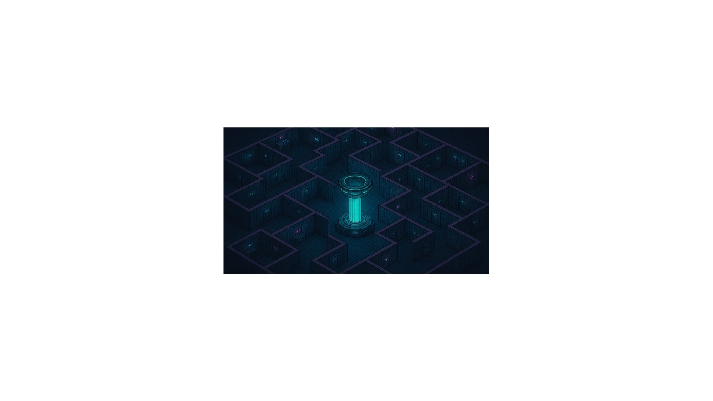

# 🎨🕹️ O Labirinto das Cores

Bem-vindo ao Labirinto das Cores Proibidas, uma aventura de RPG educacional, desenvolvida para alunos do 9º ano, que une os conceitos de grafite, artes urbanas e elementos da composição visual em uma dinâmica divertida, criativa e colaborativa.  
Este projeto é ideal para professores que desejam aplicar a gamificação e a metodologia ativa em suas aulas, utilizando dinâmicas inspiradas em RPG de mesa.

---

## 🔥 Enredo da Aventura

Em uma cidade futurista e decadente, onde as cores são proibidas e a arte foi apagada, um grupo de jovens artistas fica preso em um labirinto cyberpunk digital. As paredes estão cheias de vestígios apagados de um grafite lendário, símbolo da liberdade de expressão.  
**Seu objetivo:** reconstruir o grafite perdido para quebrar o código do sistema e libertar a criatividade da cidade!  
Cada equipe (guilda) deve desvendar enigmas, interpretar vestígios e superar limitações impostas pela rolagem de dados, utilizando os poucos recursos que possuem: folhas A4, lápis, pincéis e tintas nas cores primárias.

---

## 🎲 Como Funciona

Todos os alunos têm o mesmo desafio prático: fazer uma releitura de um grafite famoso.

O grau de dificuldade é definido por uma rolagem de d20:

- **16–20:** Visualizam o grafite original completo e podem reproduzi-lo livremente.
- **11–15:** Têm uma visão parcial (referência incompleta).
- **6–10:** O grafite está desgastado, com informações fragmentadas e tempo limitado para analisar.
- **2–5:** O grafite está praticamente invisível.
- **1 (Erro Crítico):** Além de não verem o grafite, têm restrições materiais (ex.: usar apenas lápis ou apenas pincel).

---

## 🧠 12 Perguntas – Desafio do Labirinto

Para avançar no labirinto, as guildas precisam resolver 12 enigmas de múltipla escolha sobre grafite e elementos da composição visual.

| Nº | Pergunta | Alternativas |
|----|----------|--------------|
| 1 | O que é grafite na linguagem artística? | A) Pichação • B) Pintura mural legalizada • C) Expressão visual de intervenção urbana • D) Rabisco sem sentido |
| 2 | O grafite surgiu como forma de: | A) Protesto e expressão social • B) Marketing • C) Pintura religiosa • D) Pintura clássica |
| 3 | Qual elemento básico organiza os espaços em uma obra? | A) Volume • B) Plano • C) Composição • D) Tinta |
| 4 | Cores primárias são: | A) Verde, azul, amarelo • B) Azul, vermelho, amarelo • C) Preto, branco, cinza • D) Laranja, verde, roxo |
| 5 | Uma linha que expressa movimento no grafite é chamada de: | A) Linha rígida • B) Linha orgânica • C) Linha pontilhada • D) Linha estática |
| 6 | O que significa contraste na composição? | A) Igualdade de tons • B) Diferença entre elementos • C) Suavidade das linhas • D) Desenho monocromático |
| 7 | Quando usamos formas que remetem ao mundo real, chamamos de: | A) Abstratas • B) Figurativas • C) Simbólicas • D) Aleatórias |
| 8 | O que é a técnica de stêncil no grafite? | A) Pintar com pincel • B) Usar rolo • C) Usar moldes vazados • D) Pichar letras |
| 9 | No grafite, usar perspectiva serve para: | A) Diminuir o desenho • B) Organizar textos • C) Criar profundidade • D) Fazer letras grandes |
| 10 | A mistura de vermelho e azul resulta em: | A) Verde • B) Roxo • C) Marrom • D) Laranja |
| 11 | Quando um grafite tem várias camadas sobrepostas, isso se chama: | A) Monocromia • B) Overlayer • C) Overpainting • D) Estamparia |
| 12 | Uma característica do grafite é: | A) Ser efêmero e interativo • B) Ser permanente • C) Nunca mudar • D) Ter assinatura digital |

---

## 🎨 Atividade Prática

**✍️ Desafio:**  
Releitura do grafite “O Beijo” (Eduardo Kobra) ou outra obra previamente selecionada.

**🔧 Regras de Materiais:**  
- Folhas A4  
- Lápis  
- Tintas: Vermelho, Azul e Amarelo  
- Pincéis  

O nível de acesso ao grafite depende da rolagem do dado d20, conforme tabela de dificuldade.  
As guildas podem colaborar entre si para compartilhar informações e receber bônus de XP.

---

## 🚀 Objetivos Educacionais

- Compreender os fundamentos do grafite e da arte urbana.
- Explorar elementos da composição visual.
- Desenvolver trabalho em equipe, criatividade e resolução de problemas.
- Experimentar a gamificação como ferramenta de ensino.
